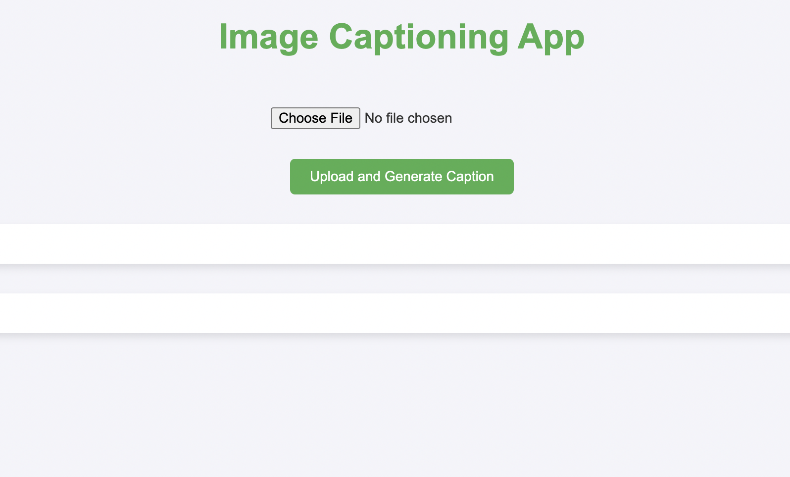

# Image Captioning Project

This project involves developing a deep learning-based system that generates textual descriptions for images using a combination of **Computer Vision** and **Natural Language Processing (NLP)** techniques. The goal is to train a model that can analyze an image and generate a meaningful, context-aware caption for it.

## Demo

## Key Components:

### 1. Image Preprocessing:
- Images are preprocessed to ensure consistency in format (resizing, normalization) before feeding them into the model.
- A **Convolutional Neural Network (CNN)** (e.g., **ResNet**, **Inception**) is used to extract features from the image.

### 2. Model Architecture:
- The extracted features from the image are passed to a **Recurrent Neural Network (RNN)**, typically using **Long Short-Term Memory (LSTM)** or **GRU** cells, for sequential data processing.
- The RNN or LSTM generates a sentence (caption) based on the image's visual features.

### 3. Training the Model:
- The model is trained using datasets containing images paired with their corresponding captions, such as the **MS COCO** dataset.
- During training, the model learns to map image features to words and generate appropriate sentences.

### 4. Caption Generation:
- After training, the model takes an unseen image, extracts its features using the CNN, and generates a caption word by word using the RNN/LSTM.
- Techniques like **beam search** or **greedy search** are used to improve caption quality.

## Tech Stack:

- **Libraries**: TensorFlow, Keras, PyTorch (for deep learning), OpenCV (for image preprocessing)
- **Model**: **CNN** for feature extraction, **RNN/LSTM** for caption generation
- **Datasets**: **MS COCO**, **Flickr8k**, **Flickr30k**
- **Languages**: Python (due to the rich ecosystem of deep learning and image processing libraries)

## Example Use Case:
This system can be applied in various fields, such as:
- **Automatic Image Captioning**: Useful for social media platforms, accessibility tools for visually impaired individuals, or image organization software.
  
The project is designed to show how deep learning models can effectively integrate visual and textual data, producing accurate and relevant captions for images.
